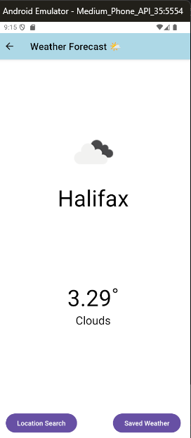
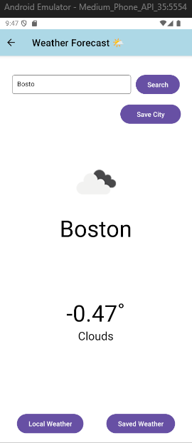
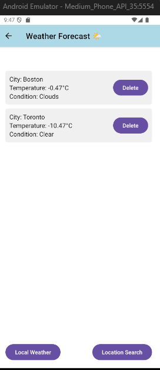

# Weather App

This is a weather app developed by **Max (Pengyao Zhao, A00476491)**.

## Getting Started

1. **Install dependencies**  
   ```bash
   npm install
   ```

2. **Run the app**  
   ```bash
   npx expo start
   ```

## Features

### Current Location Weather
Displays the weather at your current location.



### Search & Save Cities
Search for weather in specific cities and save them to favorites.



### View Saved Cities
Check the weather of saved cities.



